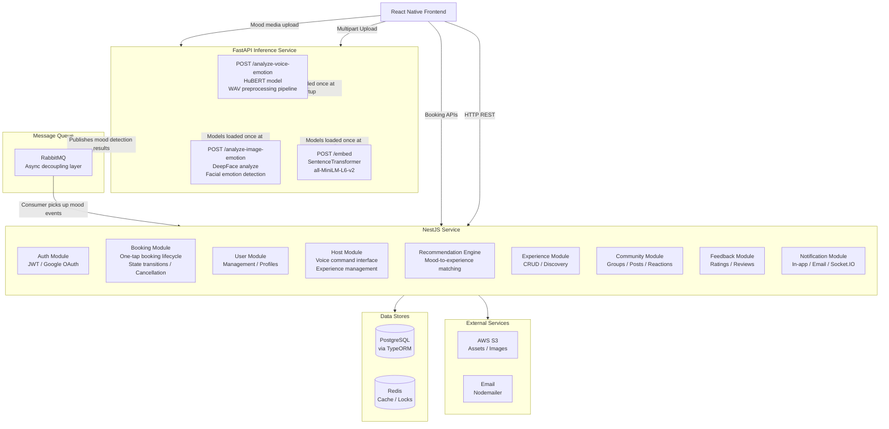
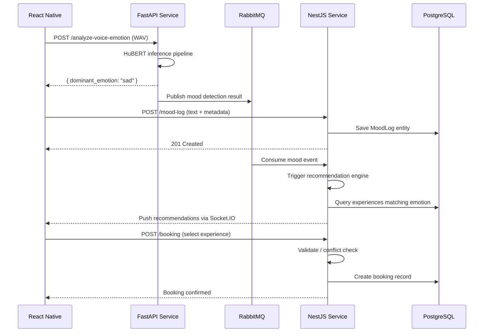

# Moodly Backend

Wellness and social experience platform powered by **two independent backend services** — a NestJS application server and a FastAPI AI inference service — connected through RabbitMQ for asynchronous mood-to-recommendation flow.

---

## Why Two Backend Services?

The system is split into two services so that **AI inference** (resource-heavy, GPU-optional) scales independently from **business logic** (booking, auth, user management). Voice emotion classification via HuBERT, facial emotion detection via DeepFace, and text embedding generation via SentenceTransformer run in the FastAPI service without blocking API response times in the NestJS service.

---

## Architecture



---

## Why RabbitMQ?

Inference latency (HuBERT voice analysis, DeepFace image processing) should not block the booking response. RabbitMQ decouples the two services:

1. FastAPI publishes mood detection results asynchronously to RabbitMQ
2. NestJS consumes mood events from RabbitMQ when ready
3. The recommendation engine triggers off the consumed mood event without blocking the API request that uploaded the media

This means:
- The frontend gets an immediate response on media upload
- The recommendation surfaces later asynchronously
- Each service scales independently — add more FastAPI replicas for inference load, more NestJS replicas for booking load

---

## FastAPI Inference Service

Three endpoints hosted on the Python FastAPI service (deployed separately).

### POST /analyze-voice-emotion

Accepts a WAV file upload, runs HuBERT-based emotion classification.

**Audio Preprocessing Pipeline** (in order):
1. Read WAV using soundfile (`sf.read`)
2. Convert numpy array to torch tensor (`torch.from_numpy`)
3. Stereo-to-mono via `torch.mean` on dimension 1 if waveform has more than 1 dimension
4. Resample to 16kHz using `torchaudio.transforms.Resample` if sample rate is not already 16000
5. Process through `Wav2Vec2FeatureExtractor` with `sampling_rate=16000, return_tensors="pt", padding=True`
6. Run inference through HuBERT model (`superb/hubert-large-superb-er`)
7. Apply softmax on logits for confidence scores
8. Map model short codes to full names: ang=angry, hap=happy, sad=sad, neu=neutral, fea=fear, sur=surprise, dis=disgust
9. Clean up temp file via `try/finally`

**Request:**
```
POST /analyze-voice-emotion
Content-Type: multipart/form-data
Body: file=<audio.wav>
```

**Response:**
```json
{
  "dominant_emotion": "happy",
  "all_emotions": {
    "happy": { "confidence": 0.82, "label": "HAPPY" },
    "neutral": { "confidence": 0.11, "label": "NEUTRAL" }
  },
  "possible_emotions": ["angry", "happy", "sad", "neutral", "fear", "surprise", "disgust"]
}
```

**Validation:** File extension must be `.wav` before processing.

---

### POST /analyze-image-emotion

Accepts an image file upload, runs DeepFace facial emotion detection.

**Request:**
```
POST /analyze-image-emotion
Content-Type: multipart/form-data
Body: file=<image>
```

**Validation:** Content type must start with `image/`.

**Response:**
```json
{
  "dominant_emotion": "happy"
}
```

---

### POST /embed

Accepts text, returns a 384-dimensional embedding vector.

**Request:**
```
POST /embed
Content-Type: application/json

{ "text": "I feel great today" }
```

**Response:**
```json
{
  "embedding": [0.123, 0.456, ...]
}
```

**Model:** `sentence-transformers/all-MiniLM-L6-v2`

---

## Model Loading Strategy

All models load **once at application startup**, not per request:

```python
# Text embedding — loaded at startup
text_model = SentenceTransformer("all-MiniLM-L6-v2")

# Voice emotion — loaded at startup
voice_model_id = "superb/hubert-large-superb-er"
voice_processor = Wav2Vec2FeatureExtractor.from_pretrained(voice_model_id)
voice_model = AutoModelForAudioClassification.from_pretrained(voice_model_id)
id2label = voice_model.config.id2label
```

This avoids reloading multi-gigabyte models on every request, keeping inference latency predictable.

---

## Error Response Schema

All FastAPI endpoints return typed error responses with two fields:

```json
{
  "reason": "human readable message",
  "errorType": "MACHINE_READABLE_CODE"
}
```

| Error Type | Trigger |
|---|---|
| INVALID_FILE_TYPE | File extension or content type does not match expected type |
| IMAGE_PROCESSING_ERROR | DeepFace analysis failed on the provided image |
| INVALID_AUDIO_FILE | soundfile could not read the WAV (LibsndfileError) |
| PROCESSING_ERROR | General inference failure during model execution |

---

## End-to-End Mood-to-Booking Flow



---

## Dependencies

### NestJS Service
NestJS 11, TypeORM, Mongoose, ioredis, RabbitMQ (amqplib + @nestjs/microservices), BullMQ, Socket.IO, Passport (JWT + Google OAuth), bcrypt, Winston, Sharp, Nodemailer, QRCode, AWS SDK v3, class-validator, class-transformer

### FastAPI Inference Service
fastapi, uvicorn, pydantic, sentence-transformers, deepface, torchaudio, torch, transformers (AutoModelForAudioClassification, Wav2Vec2FeatureExtractor), soundfile

---

## Features

### Authentication & Users
| Feature | Description |
|---|---|
| Email/Password Auth | bcrypt-hashed signup and login with access/refresh token rotation |
| Google OAuth 2.0 | Passport-based social login with JWT integration |
| Role-based Access | user, host, and admin roles with guards |
| Privacy Settings | Per-user data sharing, community visibility, and tracking consent controls |
| Cultural Profile | Ethnicity, religion, values, language preferences, and communication style |
| Onboarding Flow | Multi-step MongoDB-backed onboarding with question, goal, and activity tracking |

### Mood Logging & AI Emotion Detection
| Feature | Description |
|---|---|
| Multi-modal Logging | Text sentiment, photo emotion analysis via DeepFace, and voice sentiment via HuBERT |
| Emotion Pipeline | Mood label + photo analysis + voice analysis combined into a finalMood score |
| Daily Summaries | Mood breakdown grouped by morning, afternoon, and night periods |
| Streak Tracking | Consecutive day logging with history and pagination |
| Heatmap Data | Date-to-mood mapping for calendar visualization |
| File Storage | Uploaded media saved locally or to AWS S3 with Sharp optimization |

### Booking
| Feature | Description |
|---|---|
| One-tap Booking | Backend-validated state transitions with conflict prevention |
| Cancellation | Booking cancellation with refund placeholder and side-effect cleanup |
| Host Dashboard | Revenue stats, average ratings, and booking overview for hosts |
| QR Check-in | JWT-signed QR codes emailed to users with time-window validation |
| Concurrency Safety | Redis distributed locks preventing double-booking race conditions |

### Host Features
| Feature | Description |
|---|---|
| Voice Command Interface | Hosts create and manage experiences hands-free via voice |
| Experience CRUD | Create, update, delete experiences with rich metadata and image upload |
| Real-time Spots | Socket.IO rooms broadcasting live availability per experience |
| Public Discovery | Filtered and paginated listings by price, date, category, emotions, tags |
| AI Generation | Voice-to-text with Gemini generating complete experience fields |

### Recommendations
| Feature | Description |
|---|---|
| Mood-driven Matching | Mood detection result from FastAPI triggers experience recommendation engine |
| Embedding Search | MongoDB $vectorSearch for cosine similarity on experience vectors |
| LLM Reranking | Optional OpenAI or Gemini reranking of candidate recommendations |
| Redis Caching | TTL-based caching until midnight for fast repeated requests |
| Real-time Push | Socket.IO delivery of recommendations after mood analysis completes |

### Community
| Feature | Description |
|---|---|
| Group Management | Host-created communities with search, filtering, and privacy settings |
| Membership Roles | member, moderator, and admin roles per community |
| Posts & Reactions | Create, delete, and paginated listing with idempotent reaction upsert |
| Comments | Cursor-based pagination, author-only deletion |
| User Awareness | isJoined status, member counts, and joined-community aggregation |

### Feedback & Notifications
| Feature | Description |
|---|---|
| Post-Experience Feedback | Rating and comment with duplicate prevention and session validation |
| Automated Reminders | Cron-driven Bull queue enqueuing ended experiences for feedback |
| In-app Notifications | Persistent notifications with real-time Socket.IO delivery |
| Email Notifications | Bull queue processor sending emails via Nodemailer |
| Read Tracking | Mark individual or all notifications as read with type filtering |

### System & Infrastructure
| Feature | Description |
|---|---|
| API Documentation | Swagger UI at /api-docs auto-generated from DTOs |
| Job Monitoring | Bull Board dashboard at /admin/queues |
| Module Diagram | GET /diagram returns Mermaid dependency graph |
| Structured Logging | Winston with DailyRotateFile, request IDs via AsyncLocalStorage |
| Performance Interceptor | Per-request timing and logging |
| Input Validation | NestJS pipes with class-validator across all endpoints |
| Unit Testing | Tested business logic across booking and other modules |

---

## Outcome

The system enables:

1. Users record their emotional state through voice, photo, or text — with AI-powered emotion detection running on a dedicated inference service
2. Mood detection results flow asynchronously through RabbitMQ into the recommendation engine without blocking the upload response
3. The recommendation engine matches user mood to relevant wellness experiences
4. Users discover, book, and attend experiences with QR check-in and real-time availability
5. Hosts manage their experiences through a dashboard and voice command interface
6. Communities form around shared interests with posts, reactions, and comments
7. Post-experience feedback is collected automatically with cron-driven reminders
8. In-app and email notifications keep users informed throughout the lifecycle
9. Cultural personalization tailors experiences and community discovery to user preferences
10. The two services scale independently — FastAPI handles AI inference load, NestJS handles business logic load

---

## Next Planned Features

| Feature | Status |
|---|---|
| Hybrid Recommendation Engine | Merging emotion-based + embedding-based results with scored deduplication, batch processing, and cultural tag extraction |
| Rate Limiting Activation | ThrottlerModule ready but commented; per-route limits defined for auth (15/min), login (5/min), and general (120/min) |
| Cloudflare Tunnel | Documented integration for temporary public deployment via cloudflared |
| Community Post Embeddings | PostEmbedding schema exists for future vector-based post recommendation and search |
| Participant Matchmaking | idealParticipantTraits on Experience entity for AI-driven participant matching |
| Engagement Analytics | engagementStats JSON field on Experience for AI-driven engagement analysis |
| Extended Event Domains | Architecture supports adding FEEDBACK, BOOKINGS, ONBOARDING, and more RMQ domains as needed |

---

## Deployment

Both services are Dockerized and deployed on AWS:

| Component | Infrastructure |
|---|---|
| NestJS Service | Docker on AWS (S3 for assets) |
| FastAPI Service | Docker on AWS (scales independently) |
| Database | AWS RDS (PostgreSQL) |
| Message Queue | RabbitMQ (separate service) |
| CI/CD | GitHub Actions |

---

## Project Setup

### NestJS Service
```bash
# Install dependencies
npm install

# Start API server (port 3002)
npm run start

# Start worker server (port 3001)
npm run start:worker

# Generate TypeORM migration
npx typeorm migration:generate -n MigrationName

# Format code
npx prettier --write .
```

### FastAPI Inference Service
```bash
# Install dependencies
pip install fastapi uvicorn pydantic sentence-transformers deepface torchaudio torch transformers soundfile

# Start the server (port 8000)
uvicorn main:app --host 0.0.0.0 --port 8000
```

### Running Locally
```bash
# Start RabbitMQ (Docker)
docker run -d --name rabbitmq -p 5672:5672 -p 15672:15672 rabbitmq:management

# Start Redis (via WSL or Docker)
docker run -d --name redis -p 6379:6379 redis

# Start FastAPI service (terminal 1)
cd inference-service
uvicorn main:app --host 0.0.0.0 --port 8000

# Start NestJS service (terminal 2)
npm run start
```
