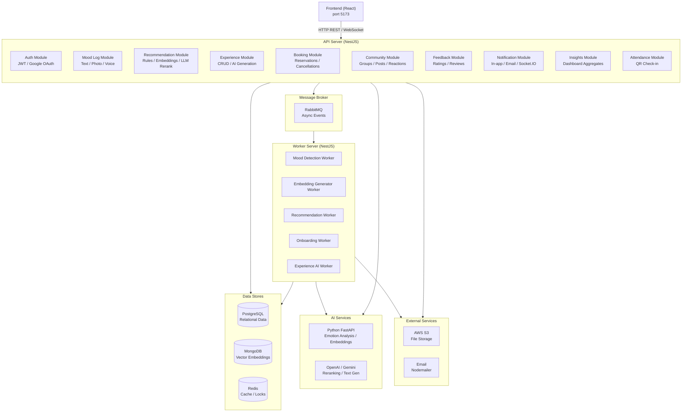
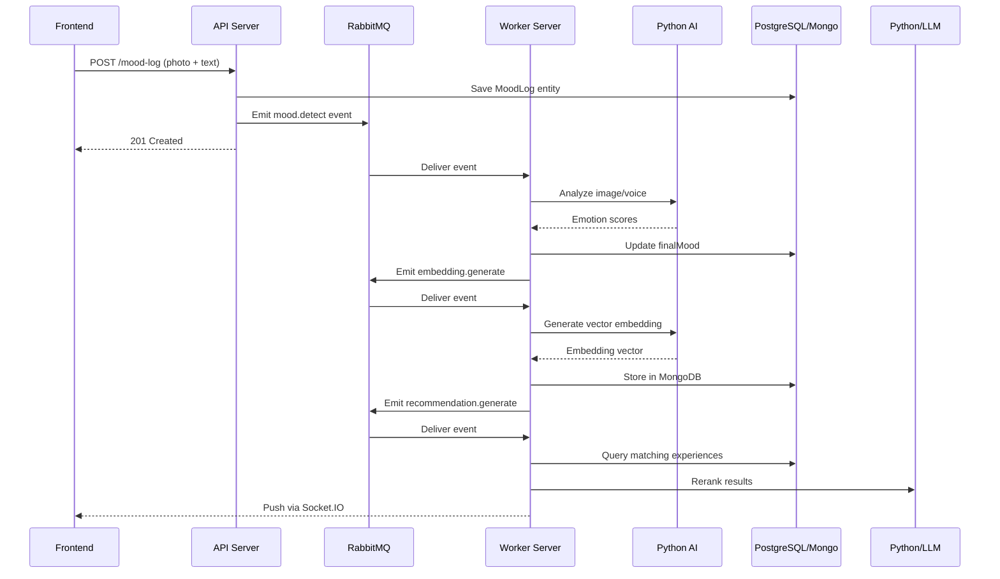

# AI-Moodler-Backend

Wellness and social experience platform backend built with **NestJS**, **TypeORM**, **Mongoose**, **Redis**, **RabbitMQ**, and **Python AI microservices**.

---

## Architecture



---

## Request Lifecycle



---

## Features

### Authentication & Users
| Feature | Description |
|---|---|
| Email/Password Auth | bcrypt-hashed signup and login with access/refresh token rotation |
| Google OAuth 2.0 | Passport-based social login with JWT integration |
| Role-based Access | user, host, and admin roles with guards |
| Privacy Settings | Per-user data sharing, community visibility, and tracking consent controls |
| Cultural Profile | Ethnicity, religion, values, language preferences, and communication style |
| Onboarding Flow | Multi-step MongoDB-backed onboarding with question, goal, and activity tracking |

### Mood Logging & AI Emotion Detection
| Feature | Description |
|---|---|
| Multi-modal Logging | Text sentiment, photo emotion analysis, and voice sentiment recording |
| Emotion Pipeline | Combines mood label + photo analysis + voice analysis into a finalMood score |
| Daily Summaries | Mood breakdown grouped by morning, afternoon, and night periods |
| Streak Tracking | Consecutive day logging with history and pagination |
| Heatmap Data | Date-to-mood mapping for calendar visualization |
| File Storage | Uploaded media saved locally and/or to AWS S3 with Sharp optimization |

### Recommendations
| Feature | Description |
|---|---|
| Emotion-to-Experience Matching | Pre-defined rules mapping emotions to experience categories |
| Embedding Search | MongoDB $vectorSearch for cosine similarity on experience vectors |
| LLM Reranking | Optional OpenAI or Gemini reranking of candidate recommendations |
| Redis Caching | TTL-based caching until midnight for fast repeated requests |
| Real-time Push | Socket.IO delivery of recommendations after mood analysis completes |

### Experiences
| Feature | Description |
|---|---|
| Host CRUD | Create, update, delete experiences with rich metadata and image upload |
| Emotional Fields | targetEmotions, desiredOutcomes, and growth dimensions per experience |
| AI Generation | Voice-to-text with Gemini generating complete experience fields |
| Real-time Spots | Socket.IO rooms broadcasting live availability per experience |
| Public Discovery | Filtered and paginated listings by price, date, category, emotions, tags |
| Cultural Tagging | Language, cultural tags, and host-defined context for inclusive discovery |

### Booking & Attendance
| Feature | Description |
|---|---|
| Reservation Flow | Validated booking with concurrency safety via Redis distributed locks |
| Cancellation | Booking cancellation with refund placeholder and side-effect cleanup |
| Host Dashboard | Revenue stats, average ratings, and booking overview for hosts |
| QR Check-in | JWT-signed QR codes emailed to users with time-window validation |
| Join Codes | Backup check-in method with attendance status tracking |

### Community
| Feature | Description |
|---|---|
| Group Management | Host-created communities with search, filtering, and privacy settings |
| Membership Roles | member, moderator, and admin roles per community |
| Posts & Reactions | Create, delete, and paginated listing with idempotent reaction upsert |
| Comments | Cursor-based pagination, author-only deletion |
| User Awareness | isJoined status, member counts, and joined-community aggregation |

### Feedback & Notifications
| Feature | Description |
|---|---|
| Post-Experience Feedback | Rating and comment with duplicate prevention and session validation |
| Automated Reminders | Cron-driven Bull queue enqueuing ended experiences for feedback |
| In-app Notifications | Persistent notifications with real-time Socket.IO delivery |
| Email Notifications | Bull queue processor sending emails via Nodemailer |
| Read Tracking | Mark individual or all notifications as read with type filtering |

### System & Infrastructure
| Feature | Description |
|---|---|
| API Documentation | Swagger UI at /api-docs auto-generated from DTOs |
| Job Monitoring | Bull Board dashboard at /admin/queues |
| Module Diagram | GET /diagram returns Mermaid dependency graph |
| Structured Logging | Winston with DailyRotateFile, request IDs via AsyncLocalStorage |
| Performance Interceptor | Per-request timing and logging |
| Rate Limiting | ThrottlerModule ready (configurable: 120 req/min default, 5 req/min login) |

---

## Outcome

The system is a **wellness and social experience platform** that:

1. Tracks emotional well-being through multi-modal AI-powered mood logging
2. Recommends personalized wellness experiences using rule-based matching, semantic embedding search, and LLM reranking
3. Connects users with curated virtual and in-person experiences created by hosts
4. Enables booking, attendance, and check-in management with QR codes and real-time spot availability
5. Builds communities around shared interests with posts, reactions, and comments
6. Gathers post-experience feedback with automated cron-driven reminders
7. Sends real-time and email notifications for bookings, check-ins, and platform events
8. Provides a unified insights dashboard showing mood trends, streaks, and engagement
9. Supports cultural personalization through user profiles and culturally-tagged experiences
10. Handles three user roles (user, host, admin) with separate interfaces and permissions

---

## Next Planned Features

| Feature | Status |
|---|---|
| Hybrid Recommendation Engine | Merging emotion-based + embedding-based results with scored deduplication, batch processing, and cultural tag extraction |
| Rate Limiting Activation | ThrottlerModule ready but commented; per-route limits defined for auth (15/min), login (5/min), and general (120/min) |
| Cloudflare Tunnel | Documented integration for temporary public deployment via cloudflared |
| Community Post Embeddings | PostEmbedding schema exists for future vector-based post recommendation and search |
| Participant Matchmaking | idealParticipantTraits on Experience entity for AI-driven participant matching |
| Engagement Analytics | engagementStats JSON field on Experience for AI-driven engagement analysis |
| Extended Event Domains | Architecture supports adding FEEDBACK, BOOKINGS, ONBOARDING, and more RMQ domains as needed |

---

## Project Setup

```bash
# Install dependencies
npm install

# Start API server (port 3002)
npm run start

# Start worker server (port 3001)
npm run start:worker

# Generate TypeORM migration
npx typeorm migration:generate -n MigrationName

# Format code
npx prettier --write .
```

### Running AI Features
```bash
# Start Python embedding service (port 8000)
# Run Redis (via WSL)
redis-cli
flushdb  # optional

# Start the NestJS project
npm run start

# Expose temporarily (optional)
lt -p 3000
```
