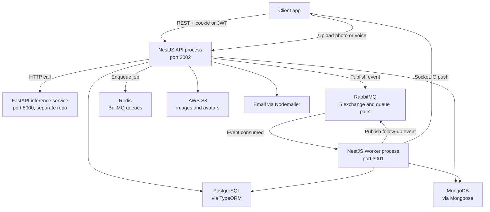
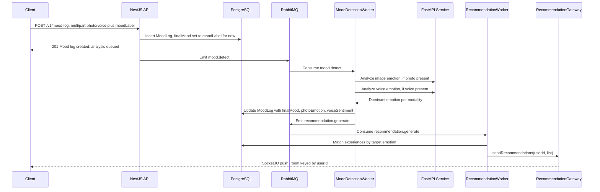

# Moodly Backend (AI Moodler)

## What this is, in plain terms

Moodly is a wellness app. A user logs how they feel right now (typing a mood, taking a photo, or recording a short voice note), and the app uses that to suggest a real activity or "experience" they can book: a guided meditation, a group walk, a workshop, a community event. Hosts create these experiences, users discover and book them, and everyone can join communities built around shared interests.

This repository is the **business backend**: accounts, bookings, experiences, communities, notifications, and the logic that turns a detected mood into a recommendation. It does not run the AI models itself. A separate FastAPI service (a different repository) does the actual emotion detection and text embedding; this backend calls out to it and reacts to the result.

If you're joining this project, the fastest way to get oriented is: read this page top to bottom once, then open the README inside whichever module you're about to touch, every folder under `src/` has one with its exact API and internal wiring.

---

## Table of Contents

- [Architecture](#architecture)
- [Project Structure](#project-structure)
- [Module Index](#module-index)
- [Backend Base Structure (how a module is wired)](#backend-base-structure-how-a-module-is-wired)
- [API Versioning](#api-versioning)
- [Features](#features)
- [Engineering Challenges Handled](#engineering-challenges-handled)
- [Event-Driven Architecture (RabbitMQ)](#event-driven-architecture-rabbitmq)
- [Background Jobs (BullMQ / Bull)](#background-jobs-bullmq--bull)
- [Sample Request Flow: Creating a Booking](#sample-request-flow-creating-a-booking)
- [Sample Event Flow: Mood Log to Recommendation](#sample-event-flow-mood-log-to-recommendation)
- [Database](#database)
- [Scale: Current Capacity and Where Overflow Goes](#scale-current-capacity-and-where-overflow-goes)
- [Auth](#auth)
- [FastAPI Inference Service (external repo)](#fastapi-inference-service-external-repo)
- [Environment Variables](#environment-variables)
- [Project Setup](#project-setup)
- [Known Gaps / Next Planned Work](#known-gaps--next-planned-work)

---

## Architecture

**Style: a modular monolith split into two deployable processes, connected by an event bus.** This is not a microservices architecture: both processes share one codebase, one set of entities, and the same Postgres/Mongo databases. It's closer to "one application, two runtimes":

- **API process** (`src/main.ts`, port `3002`): everything that answers an HTTP request. Must stay fast and responsive.
- **Worker process** (`src/worker/main.ts`, port `3001`): everything slow, retryable, or dependent on an external AI call. Runs as a separate OS process (`npm run start:worker`), consuming events from RabbitMQ.

The two are decoupled through RabbitMQ (durable, at-least-once event delivery) rather than direct function calls or HTTP, so a slow AI inference call in the worker can never block someone's booking request in the API. Real-time updates back to the client go over Socket.IO. Delayed and retryable work that stays *inside* the API process (like sending an email) goes through BullMQ instead of RabbitMQ, see [Background Jobs](#background-jobs-bullmq--bull) for why there are two different queue mechanisms.



**Stack at a glance**: NestJS 11 (TypeScript) on both processes, PostgreSQL via TypeORM for relational domain data, MongoDB via Mongoose for onboarding documents and vector embeddings, RabbitMQ for cross-process events, Redis for BullMQ job queues, Socket.IO for real-time push, JWT + Google OAuth for auth, AWS S3 for file storage, and an external FastAPI service for the actual AI models.

---

## Project Structure

```text
ai-moodler-backend/
├── src/
│   ├── main.ts                    # API process bootstrap (port 3002)
│   ├── app.module.ts              # composition root, imports every feature module
│   ├── app.controller.ts / app.service.ts
│   │
│   ├── auth/                      # JWT (access+refresh) + Google OAuth
│   ├── users/                     # user CRUD, plus profile/ (self-service, avatar, password)
│   ├── onboarding/                 # multi-step onboarding, Mongo-backed, user + host variants
│   ├── experience/                 # bookable "experience" domain, host/public/user controllers
│   ├── booking/                    # booking lifecycle, race-safe creation, host dashboards
│   ├── attendance/                 # QR / join-code check-in, one-to-one with booking
│   ├── mood-log/                   # mood logging (text/photo/voice), starts the mood event chain
│   ├── embedding/                  # text embedding generation + Mongo vector storage
│   ├── recommendation/             # emotion + embedding based matching, optional LLM rerank
│   ├── feedback/                   # post-experience ratings, cron-driven reminder queue
│   ├── notification/               # in-app, email, and Socket.IO notifications
│   ├── community/                  # groups, posts, reactions, comments
│   ├── insights/                   # aggregated user analytics
│   ├── diagram/                    # GET /v1/diagram, live Mermaid module graph
│   │
│   ├── common/                     # cross-cutting: S3, Gemini, FastAPI client, ResultDto, roles guard
│   ├── logger/                     # Winston config, AsyncLocalStorage request id
│   ├── database/                   # TypeORM + Mongoose module, migrations, data-source
│   │
│   ├── infra/                      # technical plumbing, not domain logic (see src/infra/README.md)
│   │   ├── redis/                   # RedisService: ioredis wrapper, cache + lock primitives
│   │   ├── rmq/                     # RmqModule: RabbitMQ producer client factory
│   │   ├── config/                  # RMQ_DOMAINS: exchange/queue/routing-key map
│   │   └── bull-board/              # mounts the Bull Board admin UI at /admin/queues
│   │
│   └── worker/                     # SEPARATE process entrypoint (main.ts, port 3001)
│       ├── mood-detection.worker.ts
│       ├── embedding.worker.ts
│       ├── recommendation.worker.ts
│       ├── onboarding.worker.ts
│       └── experience.worker.ts
│
├── certs/rds-ca.pem                # RDS Postgres SSL cert (production only)
├── test/jest-e2e.json              # e2e harness config (no specs committed yet)
├── init.sql                        # manual schema reference (pgcrypto + vector extensions)
├── AGENTS.md, CLAUDE.md            # instructions for AI coding agents working in this repo
├── nest-cli.json, tsconfig*.json, eslint.config*.mjs
└── package.json
```

---

## Module Index

Every module below has its own `README.md` with the full endpoint reference: method, route, guards, request/response shape. This root document covers cross-cutting architecture only.

| Module | Path | README |
|---|---|---|
| Auth | `src/auth` | [src/auth/README.md](src/auth/README.md) |
| Users | `src/users` | [src/users/README.md](src/users/README.md) |
| Profile | `src/users/profile` | [src/users/profile/README.md](src/users/profile/README.md) |
| Onboarding | `src/onboarding` | [src/onboarding/README.md](src/onboarding/README.md) |
| Experience | `src/experience` | [src/experience/README.md](src/experience/README.md) |
| Booking | `src/booking` | [src/booking/README.md](src/booking/README.md) |
| Attendance | `src/attendance` | [src/attendance/README.md](src/attendance/README.md) |
| Mood Log | `src/mood-log` | [src/mood-log/README.md](src/mood-log/README.md) |
| Embedding | `src/embedding` | [src/embedding/README.md](src/embedding/README.md) |
| Recommendation | `src/recommendation` | [src/recommendation/README.md](src/recommendation/README.md) |
| Feedback | `src/feedback` | [src/feedback/README.md](src/feedback/README.md) |
| Notification | `src/notification` | [src/notification/README.md](src/notification/README.md) |
| Community | `src/community` | [src/community/README.md](src/community/README.md) |
| Insights | `src/insights` | [src/insights/README.md](src/insights/README.md) |
| Diagram | `src/diagram` | [src/diagram/README.md](src/diagram/README.md) |
| Common | `src/common` | [src/common/README.md](src/common/README.md) |
| Database | `src/database` | [src/database/README.md](src/database/README.md) |
| Worker process | `src/worker` | [src/worker/README.md](src/worker/README.md) |
| Infra (overview) | `src/infra` | [src/infra/README.md](src/infra/README.md) |
| &nbsp;&nbsp;Redis | `src/infra/redis` | [src/infra/redis/README.md](src/infra/redis/README.md) |
| &nbsp;&nbsp;RabbitMQ client | `src/infra/rmq` | [src/infra/rmq/README.md](src/infra/rmq/README.md) |
| &nbsp;&nbsp;Config | `src/infra/config` | [src/infra/config/README.md](src/infra/config/README.md) |
| &nbsp;&nbsp;Bull Board | `src/infra/bull-board` | [src/infra/bull-board/README.md](src/infra/bull-board/README.md) |

---

## Backend Base Structure (how a module is wired)

Every feature module follows the same NestJS layering, for example `booking`:

```
Controller  (HTTP layer: guards, DTO validation, HTTP status mapping)
    |
Service (orchestrator, e.g. BookingService)
    |
Specialized services (single responsibility: *-creation, *-validation,
    *-query, *-mapper, *-side-effects, *-error-handler, *-stats ...)
    |
TypeORM Repository / Mongoose Model  ->  PostgreSQL / MongoDB
```

Conventions used across the codebase:

- **Guards stack**: most protected routes use `@UseGuards(JwtBearerGuard, JwtCookieGuard, RolesGuard)`. `JwtCookieGuard` alone already reads the `jwt` httpOnly cookie or falls back to an `Authorization: Bearer` header, so `JwtBearerGuard` is redundant on routes that also apply `JwtCookieGuard`, kept for explicitness in most controllers.
- **Response envelope**: almost every handler returns `ResultDto.ok(data, message, statusCode)` or throws an `HttpException` built from `ResultDto.fail(...)`, giving a consistent `{ success, statusCode, data, message }` / `{ success: false, statusCode, reason, errorType }` shape across the whole API (`src/common/dto/result.dto.ts`, `src/common/constants/error-code-map.ts`).
- **Validation**: global `ValidationPipe({ transform: true, whitelist: true })` (`src/main.ts`); every DTO uses `class-validator` decorators.
- **Fire-and-forget side effects**: write-path services (e.g. `BookingCreationService`) commit the DB transaction first, then dispatch notifications and attendance creation as detached promises (`.catch()`-guarded, not awaited), so a slow email or notification path never adds latency to the HTTP response.
- **Split controllers per audience**: several domains (`experience`, `booking`, `onboarding`) expose separate `host/*`, `user/*`, and `public/*` controllers instead of one controller with internal role branching, keeping route-level guards and Swagger tags unambiguous.

---

## API Versioning

Every HTTP route in this API is served under `/v1/...` via NestJS's built-in URI versioning (`app.enableVersioning({ type: VersioningType.URI, defaultVersion: '1' })` in `src/main.ts`). `POST /auth/login` from an older version of this README (or any client hardcoded before this change) is now `POST /v1/auth/login`, and so on for every route documented in this file and every module README.

This exists to protect anyone building against this API (a mobile app, a future webhook consumer, an internal admin tool) from breaking changes: a future incompatible change to, say, the booking response shape can ship as a new `/v2/user/bookings` route on a specific controller (`@Controller({ path: 'user/bookings', version: '2' })`) while every existing `/v1/...` integration keeps working unmodified, no big-bang cutover required.

**Two routes are deliberately excluded** (`version: VERSION_NEUTRAL`) rather than versioned, following the same convention most production APIs use:
- `GET /` (`AppController`), a bare root route intended for load balancer health checks and uptime monitors that shouldn't need to know the current API version to hit it.
- Swagger UI (`/api-docs`) and Bull Board (`/admin/queues`) aren't affected either way, they're mounted directly rather than through a versioned Nest controller, so they were never prefixed and still aren't.

Everything else, including the dev-only `/v1/diagram` introspection route, gets the default `/v1/` prefix automatically, nothing had to change per-controller. Socket.IO gateways are untouched by this: `enableVersioning` only applies to HTTP routes, not WebSocket connections.

Regression-tested in `test/versioning.e2e-spec.ts` (an isolated check against throwaway controllers, not the full `AppModule`, since that needs a reachable Postgres/Mongo/Redis/RabbitMQ that a fast unit-style e2e test shouldn't depend on): confirms a route with no explicit version is served at `/v1/`, is not reachable without the prefix, and that a controller opting into `version: '2'` is served at `/v2/` instead.

---

## Features

### Authentication & Users
| Feature | Description |
|---|---|
| Email/Password Auth | bcrypt-hashed (cost 12) signup and login with access/refresh token rotation |
| Google OAuth 2.0 | Passport-based social login, find-or-create by email |
| Role-based Access | `user`, `host`, `admin` roles enforced via `RolesGuard` + `@Roles()` |
| Privacy Settings | Per-user data sharing, community visibility, tracking consent |
| Cultural Profile | Ethnicity, religion, values, language preferences, communication style |
| Onboarding Flow | Multi-step MongoDB-backed onboarding (questions, goals, activities), separate flows for users and hosts |

### Mood Logging & AI Emotion Detection
| Feature | Description |
|---|---|
| Multi-modal Logging | Text label, photo emotion (DeepFace), and voice sentiment (HuBERT), combined into `finalMood` |
| Async Analysis | Photo/voice analysis runs off the request path via RabbitMQ (`mood.detect` to worker) |
| Daily Summaries | Mood breakdown grouped into morning, afternoon, night |
| Streak & Heatmap | Consecutive-day streak calculation and date-to-mood heatmap data |
| File Storage | Uploaded media saved locally or to S3, downloaded back to a temp file when re-sent to FastAPI |

### Booking & Experiences
| Feature | Description |
|---|---|
| Race-safe Booking | Single CTE with `SELECT ... FOR UPDATE` inside a DB transaction atomically checks capacity and reserves a spot, see [Engineering Challenges](#engineering-challenges-handled) |
| Cancellation & Rebooking | Cancelling sets `status='cancelled'`; rebooking the same experience restores the row instead of inserting a duplicate |
| Host Dashboard | Revenue, average rating, 90-day trend, funnel, and emotional-outcome stats |
| QR Check-in | Signed token (`ATTENDANCE_JWT_SECRET`) turned into a QR code for in-person check-in |
| Real-time Spots | Socket.IO room per experience broadcasts `spotsLeft` after every booking or cancellation |
| AI Experience Generation | Host speaks or types a description; Gemini turns it into structured experience fields |

### Recommendations
| Feature | Description |
|---|---|
| Mood-driven Matching | Active path: `generateForUserByMood` matches experiences to the user's latest detected mood |
| Embedding Search | Secondary path: Mongo vector search + LLM rerank (OpenAI or Gemini, `RANKING_PROVIDER`), implemented but not yet wired to a controller |
| Real-time Push | Recommendations delivered over Socket.IO the moment the worker finishes processing |

### Community
| Feature | Description |
|---|---|
| Group Management | Host-created communities, public search/filter, privacy settings |
| Membership Roles | member / moderator / admin per community |
| Posts, Reactions, Comments | Idempotent reaction upsert, cursor-paginated comments, author-only deletes |

### Feedback & Notifications
| Feature | Description |
|---|---|
| Post-Experience Feedback | Rating and comment, duplicate prevention |
| Automated Reminders | Cron job finds ended experiences and enqueues a Bull job per attendee (see the note on the cron expression under [Known Gaps](#known-gaps--next-planned-work)) |
| In-app + Email + Push (partial) | Notification row and Socket.IO push always happen; email is queued through BullMQ; push is stubbed |

### System & Infrastructure
| Feature | Description |
|---|---|
| API Documentation | Swagger UI at `/api-docs` |
| Job Monitoring | Bull Board dashboard at `/admin/queues` |
| Live Module Graph | `GET /v1/diagram` renders a Mermaid dependency graph of the running app via `nestjs-spelunker` |
| Structured Logging | Winston, daily-rotating file transport, per-request id via `AsyncLocalStorage` |
| Input Validation | Global `ValidationPipe` + `class-validator` on every DTO |

---

## Engineering Challenges Handled

**1. Preventing double-booking under concurrency.**
Two users tapping "book" on the last spot of an experience at the same instant is a classic race condition. `BookingCreationService.tryCreateOrRestoreBooking` (`src/booking/services/user/booking-creation.service.ts`) handles it with a single raw-SQL statement, executed inside a `READ COMMITTED` transaction opened by `TransactionService` (`src/common/services/transaction.service.ts`):
```sql
WITH selected_experience AS (
  SELECT e.* FROM "experience" e WHERE e.id = $1 FOR UPDATE   -- row-locks the experience
), ...
insert_new AS (
  INSERT INTO "booking" (...)
  SELECT $1, $2, 'confirmed', now()
  FROM selected_experience se
  WHERE NOT EXISTS (...) AND se."spotsFilled" < se."totalSpots"   -- capacity check and insert, atomically
  RETURNING *
), update_spots AS ( UPDATE "experience" SET "spotsFilled" = "spotsFilled" + 1 ... )
```
The `FOR UPDATE` lock serializes concurrent bookings for the *same experience* at the database level, so the capacity check and the insert can never race: a second transaction blocks on the row lock until the first commits, then sees the updated `spotsFilled` and correctly fails with "No available spots". This is stronger than an application-level Redis lock because it can't drift out of sync with the actual row.

> Note: `RedisService` also exposes `acquireLock`/`releaseLock` (Lua-script-based `SET NX` plus compare-and-delete), but it is not currently called anywhere in the codebase, booking concurrency is handled entirely at the Postgres layer today.

**2. Decoupling slow AI inference from the request/response cycle.**
Emotion analysis (HuBERT, DeepFace) and embedding generation take real time and call an external service. Rather than making `POST /v1/mood-log` wait on that, the endpoint persists the raw log and returns `201` immediately, then emits a `mood.detect` event onto RabbitMQ. The separate worker process consumes it, calls FastAPI, writes the result back, and chains a follow-up event to regenerate recommendations, see [Sample Event Flow](#sample-event-flow-mood-log-to-recommendation).

**3. Two data stores for two shapes of data.** Relational, highly-related domain data (users, bookings, experiences, community) lives in PostgreSQL via TypeORM, where foreign keys and transactions matter. Loosely-structured, evolving documents (onboarding answers, embedding vectors) live in MongoDB via Mongoose, where schema flexibility matters more than joins.

**4. Keeping the HTTP response fast when a write has multiple side effects.** Booking creation triggers attendance-record creation and a notification and a Socket.IO broadcast. All three run after the DB transaction commits, as detached (non-awaited, `.catch()`-guarded) calls, so a slow email or notification path never adds latency to the booking response, at the cost of those side effects being best-effort rather than transactionally guaranteed.

**5. Duplicate work across a host/user/public split.** `experience` and `booking` (and `onboarding`) expose separate controllers per audience instead of one controller with role branching inside each handler, keeping `@UseGuards`/`@Roles` declarative and unambiguous per route, at the cost of some duplication between `experience.controller.ts` (legacy combined controller, still registered) and the newer `controllers/experience.*.controller.ts` split. Worth consolidating, see [Known Gaps](#known-gaps--next-planned-work).

---

## Event-Driven Architecture (RabbitMQ)

The API process and the worker process are two separate Nest applications connected only by RabbitMQ, no direct function calls cross the process boundary.

**Domain registry** (`src/infra/config/rmq.constants.ts`) defines one exchange plus one durable queue per domain:

| Domain | Exchange | Queue | Routing keys |
|---|---|---|---|
| Mood | `mood-exchange` | `mood-tasks` | `mood.detect`, `mood.analyzed` |
| Community | `community-exchange` | `community-tasks` | `community.embedding.generate` |
| Recommendation | `recommendation-exchange` | `recommendation-tasks` | `recommendation.generate` |
| Onboarding | `onboarding-exchange` | `onboarding-tasks` | `onboarding.completed` |
| Experience | `experience-exchange` | `experience-tasks` | `experience.generate_ai` |

**Producers** (`ClientProxy.emit(...)`, fire-and-forget, no reply expected): API-side services inject the relevant client (e.g. `@Inject(RMQ_DOMAINS.MOOD.CLIENT)`) via `RmqModule.register(...)` (`src/infra/rmq/rmq.module.ts`).

**Consumers**: `src/worker/main.ts` boots a single Nest application (`WorkerModule`) that opens **five separate RabbitMQ connections**, one per domain, each with `prefetchCount: 1` (process one message at a time per domain before acking the next):

- `mood-detection.worker.ts`, listens for `mood.detect`: calls FastAPI for photo/voice analysis, writes `finalMood` back to the `MoodLog` row, then emits `recommendation.generate`.
- `embedding.worker.ts`, listens for `mood.analyzed` and `community.embedding.generate`: generates and stores vector embeddings in Mongo.
- `recommendation.worker.ts`, listens for `recommendation.generate`: runs the recommendation engine and pushes results over Socket.IO.
- `onboarding.worker.ts`, listens for `onboarding.completed`: flips `user.onboardingCompleted`.
- `experience.worker.ts`, listens for `experience.generate_ai`: runs Gemini experience-field generation and saves it onto the `Experience` row.

Run the worker as its own process: `npm run start:worker` (separate from `npm run start`, which only runs the API).

---

## Background Jobs (BullMQ / Bull)

Two message-passing systems coexist for two different jobs: RabbitMQ moves events **between the API and worker processes**; BullMQ/Bull moves **delayed and retryable jobs within the API process itself**, backed by Redis.

> Two different queue libraries are in use side by side: `main.ts` instantiates queues directly with the modern `bullmq` package (for Bull Board), while the actual job processors are registered through `@nestjs/bull` (a wrapper around the older `bull` package). Functionally compatible since both point at the same Redis queues, but worth knowing if you're adding a new queue, follow the `@nestjs/bull` pattern used by the existing processors below.

| Queue | Registered in | Producer | Processor | Purpose |
|---|---|---|---|---|
| `notification-queue` | `src/notification/notification.module.ts` | `NotificationService.createAndSend()` | `src/notification/jobs/notification.processor.ts` | Sends email via Nodemailer (`type: 'email'`); `type: 'push'` is stubbed, not implemented |
| `feedback-request` | `src/feedback/queues/feedback-queue.module.ts` | `src/feedback/jobs/feedback.cron.ts` (`@Cron`, `@nestjs/schedule`) | `src/feedback/queues/feedback-request.processor.ts` | Creates a `PendingFeedback` row per attendee once an experience's session has ended |
| `mood-queue` | `src/infra/bull-board/bull-board.module.ts` | registered for Bull Board visibility | none | Currently monitoring-only; mood processing itself runs through RabbitMQ, not this queue |

All three queues are also visible (jobs, retries, failures) in Bull Board at `GET /admin/queues`, see [src/infra/bull-board/README.md](src/infra/bull-board/README.md).

---

## Sample Request Flow: Creating a Booking

`POST /v1/user/bookings` end-to-end, tracing real files:

```mermaid
sequenceDiagram
    participant C as Client
    participant G as Guards
    participant Ctrl as UserBookingController
    participant Svc as BookingService
    participant Create as BookingCreationService
    participant DB as PostgreSQL
    participant Side as BookingSideEffectsService
    participant WS as ExperienceGateway

    C->>G: POST /v1/user/bookings with experienceId
    G->>G: Verify JWT and role
    G->>Ctrl: Forward validated request
    Ctrl->>Svc: createBooking(userId, dto)
    Svc->>Create: createBooking(userId, dto)
    Create->>DB: Begin transaction, READ COMMITTED
    Create->>DB: Lock experience row, check capacity, insert or restore booking
    DB-->>Create: Booking row, or a failure reason
    Create->>DB: Commit transaction
    Create->>Side: Queue side effects, not awaited
    Create->>WS: Emit updated spot count
    Create-->>Svc: Success result
    Svc-->>Ctrl: Success result
    Ctrl-->>C: 201 Created

    Note over Side,C: Afterward, asynchronously: attendance row created,<br/>notification saved, email queued, Socket.IO push sent
```

Key points this illustrates:
- The guard chain runs before the DTO is even parsed by `ValidationPipe`, so unauthenticated requests never reach validation or the service layer.
- The entire capacity-check-and-reserve step is one database round trip inside one transaction (see [Engineering Challenges](#engineering-challenges-handled)), there is no read-then-write gap for a race to exploit.
- Everything after the transaction commits (attendance, notification, email, Socket.IO) is fire-and-forget: the client gets its `201` as soon as the booking row exists, not after every side effect completes.

---

## Sample Event Flow: Mood Log to Recommendation

`POST /v1/mood-log` with a voice/photo upload, through both processes:



The client that uploaded the mood log gets an immediate `201`, then, seconds later and asynchronously, a Socket.IO push with recommendations once both hops through RabbitMQ complete. No HTTP polling is needed on the client side.

---

## Database

Two databases, both configured in `src/database/database.module.ts`, shared by the API process and the worker process (each process opens its **own** connection pool to each):

| Store | Driver | Used for |
|---|---|---|
| PostgreSQL | TypeORM (`pg`) | Users, experiences, bookings, attendance, feedback, notifications, community, anything relational |
| MongoDB | Mongoose | Onboarding documents, vector embeddings (experience/moodlog/community/post) |

- `synchronize: NODE_ENV !== 'production'`: schema auto-syncs from entities outside production; production relies on TypeORM migrations under `src/database/migrations/` (run via `npm run migration:run:prod`).
- Production Postgres connections use SSL with the bundled RDS CA cert (`certs/rds-ca.pem`).
- **No explicit pool size is configured anywhere** (`extra.max`, `poolSize`, etc. are all absent), both drivers run on their library defaults. See [Scale](#scale-current-capacity-and-where-overflow-goes) for what that means in practice.

---

## Scale: Current Capacity and Where Overflow Goes

This section describes the **capacity implied by what's actually configured in this repo today**, not a load-tested SLA. There is no `extra.max`, `poolSize`, PgBouncer, Node cluster mode, PM2 config, or Docker/Kubernetes replica setup anywhere in the repository, so the numbers below describe a **single API instance plus a single worker instance**, each talking directly to Postgres, Mongo, and Redis.

| Resource | Default in effect | Source |
|---|---|---|
| Postgres pool (API process) | `max: 10` connections (node-postgres / `pg` default, TypeORM doesn't override it) | `src/database/database.module.ts` |
| Postgres pool (worker process) | `max: 10` connections, a **separate pool** from the API's | `src/worker/worker.module.ts` (imports the same `DatabaseModule`, but as its own process it gets its own pool) |
| Mongoose pool (per process) | `maxPoolSize: 100` (Mongoose default) | `src/database/database.module.ts` |
| Redis | 1 TCP connection via `ioredis`, no connection pooling (Redis is single-threaded per connection anyway; BullMQ opens its own separate connections per queue) | `src/infra/redis/redis.service.ts`, `src/main.ts` |
| RabbitMQ worker concurrency | `prefetchCount: 1` times 5 domain connections = **at most 5 events processed in parallel**, one per domain, across the whole worker process | `src/worker/main.ts` |
| HTTP concurrency (API) | Bounded by Node's single-threaded event loop per process, no cluster/PM2 config present, so one process is one CPU core doing request handling | `src/main.ts` |

**What this means concretely:**

- **Concurrent HTTP connections**: Node/Express can accept and hold open many hundreds of concurrent sockets fine (I/O is non-blocking), but any handler that touches Postgres is capped at **10 simultaneous in-flight queries** per API instance. The 11th concurrent DB-bound request doesn't fail, it queues inside node-postgres's internal pool wait queue until a connection frees up, and only fails if the caller-side timeout (client/proxy) is hit first, since no explicit `connectionTimeoutMillis` is set on the pool.
- **How many users, and how many concurrent users**: there's no hard cap enforced by the app (rate limiting is installed but disabled, see below), so this is really "how many concurrent DB-bound requests can be serviced without queuing," which today is **around 10 per API instance**. Read-heavy, non-DB-bound traffic (like static Swagger docs) isn't affected by this ceiling. Realistic total concurrent users the system can serve without visibly increasing latency depends on how many requests per user are in flight at once, but with a 10-connection pool and typical query times in the tens of milliseconds, sustained throughput is on the order of a few hundred DB-touching requests per second on default hardware before the pool becomes the bottleneck, well below what the underlying Postgres instance itself could otherwise support.
- **Where overflow goes**: it doesn't get rejected, it queues, at two levels: (1) inside the node-postgres pool's wait queue once more than 10 queries are in flight, and (2) inside RabbitMQ's durable queues once event throughput exceeds what `prefetchCount: 1` per domain can drain (messages simply sit in the queue, durable, so they survive a worker restart, until a worker connection is free to consume the next one). Neither layer drops work; both simply add latency under load. There is currently no dead-letter queue, no queue-depth alerting, and no backpressure signal sent back to the API when the worker falls behind.
- **Max simultaneous DB connections across the whole system**: with one API instance plus one worker instance, that's `10 (API) + 10 (worker) = 20` Postgres connections at steady state, plus a handful more from ad-hoc `typeorm` CLI usage (migrations). A typical small managed Postgres tier (e.g. AWS RDS `db.t3.micro`) caps `max_connections` around 65 to 100, so this repo's defaults leave headroom for roughly **3 to 4 more full API+worker replica pairs** before hitting that ceiling, but nothing here coordinates that; adding replicas today would require either raising `max_connections`, adding an explicit `extra.max` per instance, or introducing a pooler (PgBouncer / RDS Proxy) so pool sizes don't need to shrink as replicas grow.
- **Rate limiting is not currently active.** `@nestjs/throttler` is installed and pre-configured (`default`: 120 req/min, `auth`: 15 req/min, `login`: 5 req/min) but the whole `ThrottlerModule.forRoot([...])` block and its `APP_GUARD` provider are commented out in `src/app.module.ts`. Several controllers still carry `@SkipThrottle()`, which is currently a no-op since no `ThrottlerGuard` is registered anywhere. Until this is re-enabled, nothing in the app itself protects against a single client opening far more concurrent requests than the pool can serve.

**To raise these ceilings**, in order of effort: (1) set `extra: { max: N }` on the TypeORM config and re-tune per available `max_connections`; (2) re-enable `ThrottlerModule` in `app.module.ts`; (3) run the API behind a load balancer with multiple replicas plus a connection pooler in front of Postgres; (4) raise `prefetchCount` on the worker's RMQ connections (trades ordering/backpressure safety for throughput); (5) move Redis to a clustered/managed tier if BullMQ throughput becomes the bottleneck.

---

## Auth

- **JWT** access and refresh tokens (`@nestjs/jwt`), both currently signed with a **7-day** expiry (`src/auth/auth.service.ts`), the refresh token hash is stored (bcrypt) on the `User` row and rotated on every `/auth/refresh` call.
- The `jwt` httpOnly cookie itself is set with `maxAge: 24h` (`src/auth/auth.controller.ts`), which is shorter than the JWT's own 7-day expiry, the cookie expires and forces a re-login well before the token would.
- **Google OAuth 2.0** via Passport (`src/auth/strategies/google.strategy.ts`): find-or-create by email, then issues the same JWT pair.
- **Guards**: `JwtCookieGuard` (cookie, falls back to `Authorization: Bearer`), `JwtBearerGuard` (bearer-only), `RolesGuard` + `@Roles()` (`src/common/roles.guard.ts`). Most protected routes stack all three, though `JwtBearerGuard` is redundant wherever `JwtCookieGuard` is also present.
- **Attendance** uses a separate signed token (`ATTENDANCE_JWT_SECRET`/`ATTENDANCE_JWT_EXPIRATION`) for QR check-in, independent of the login JWT.
- Full endpoint reference: [src/auth/README.md](src/auth/README.md).

---

## FastAPI Inference Service (external repo)

This NestJS backend calls out to a separate Python FastAPI service (not part of this repository) via `ApiClientService` (`src/common/services/api-client.service.ts`, base URL `FASTAPI_URL`, bearer-token'd with `HF_TOKEN`). It exposes three endpoints:

| Endpoint | Model | Purpose |
|---|---|---|
| `POST /analyze-voice-emotion` | HuBERT (`superb/hubert-large-superb-er`) | WAV upload to dominant emotion plus per-class confidence |
| `POST /analyze-image-emotion` | DeepFace | Image upload to dominant facial emotion |
| `POST /embed` | SentenceTransformer (`all-MiniLM-L6-v2`) | Text to a 384-dimensional embedding vector |

All three models load once at FastAPI startup, not per request, to keep inference latency predictable. See `src/mood-log/services/emotion-analysis.service.ts` and `src/embedding/services/embedding.service.ts` for the calling code on this side.

---

## Environment Variables

See [`.env.example`](.env.example) for the full list of keys this repo reads (no real values are committed, `.env` is gitignored). Grouped summary:

| Group | Keys |
|---|---|
| Postgres | `POSTGRES_HOST`, `POSTGRES_PORT`, `POSTGRES_USER`, `POSTGRES_PASSWORD`, `POSTGRES_DB` |
| Mongo | `MONGO_URI`, `MONGO_DB` |
| Redis | `REDIS_URL` |
| App | `NODE_ENV`, `PORT`, `FRONTEND_URL` |
| Auth | `JWT_SECRET`, `JWT_REFRESH_SECRET`, `ATTENDANCE_JWT_SECRET`, `ATTENDANCE_JWT_EXPIRATION`, `GOOGLE_CLIENT_ID`, `GOOGLE_CLIENT_SECRET`, `GOOGLE_CALLBACK_URL` |
| RabbitMQ | `RABBITMQ_URL`, `RMQ_MOOD_QUEUE`/`RMQ_MOOD_EXCHANGE`, `RMQ_COMM_QUEUE`/`RMQ_COMM_EXCHANGE`, `RMQ_REC_QUEUE`/`RMQ_REC_EXCHANGE`, `RMQ_ONBOARDING_QUEUE`/`RMQ_ONBOARDING_EXCHANGE`, `RMQ_EXP_QUEUE`/`RMQ_EXP_EXCHANGE` |
| AI | `GEMINI_API_KEY`, `OPENAI_API_KEY`, `RANKING_PROVIDER`, `FASTAPI_URL`, `HF_TOKEN` |
| Storage | `AWS_REGION`, `AWS_ACCESS_KEY_ID`, `AWS_SECRET_ACCESS_KEY`, `S3_BUCKET`, `S3_BASE_URL`, `EXPERIENCE_IMAGES_CDN_URL`, `UPLOADS_DIR` |
| Email | `SMTP_HOST`, `SMTP_PORT`, `SMTP_USER`, `SMTP_PASS`, `SMTP_FROM` |
| Logging | `LOG_LEVEL`, `LOG_DIR` |

> Double-check `RMQ_REC_QUEUE`/`RMQ_REC_EXCHANGE` against your deployment's `.env`, `src/infra/config/rmq.constants.ts` reads those exact names, while some `.env` files in the wild use `RMQ_RECOMMENDATION_QUEUE` instead, which the code will silently ignore in favor of the hardcoded default.

---

## Project Setup

```bash
# install dependencies
npm install

# build (verifies the whole project compiles)
npm run build

# run the unit test suite (no external services required, everything is mocked)
npm test

# start the API server, http://localhost:3002, Swagger at /api-docs, Bull Board at /admin/queues
npm run start

# start the worker process, consumes RabbitMQ, must run alongside the API for
# mood analysis, recommendations, and AI experience generation to complete
npm run start:worker

# generate a new TypeORM migration after changing an entity
npx typeorm migration:generate -n MigrationName

# apply migrations in production
npm run migration:run:prod
```

Requires a reachable PostgreSQL instance, MongoDB instance, Redis instance, and RabbitMQ broker, see [`.env.example`](.env.example) for every variable that needs a value. Locally, the quickest way to get RabbitMQ/Redis running is:

```bash
docker run -d --name rabbitmq -p 5672:5672 -p 15672:15672 rabbitmq:management
docker run -d --name redis -p 6379:6379 redis
```

No Dockerfile/docker-compose/CI workflow exists in this repository, deployment tooling for this service lives outside this repo today.

---

## Known Gaps / Next Planned Work

| Item | Notes |
|---|---|
| Rate limiting disabled | `ThrottlerModule` is fully configured but commented out in `src/app.module.ts`, see [Scale](#scale-current-capacity-and-where-overflow-goes) |
| Inconsistent bcrypt cost factors | Password hashing uses cost 12, refresh-token hashing uses cost 10 (`src/auth/auth.constants.ts`), not a documented design choice, worth deciding whether to unify |
| No `start:dev` npm script | `@nestjs/cli` is a dependency but there's no watch-mode script; run `npx nest start --watch` directly for now |
| No end-to-end tests yet | `npm run test:e2e` is wired to `test/jest-e2e.json` and passes trivially (`--passWithNoTests`), but no `*.e2e-spec.ts` files exist yet, only unit tests (`npm test`) currently exercise real behavior |
| Legacy duplicate experience controller | `src/experience/experience.controller.ts` overlaps with the newer `controllers/experience.host/public/user.controller.ts` split, both are currently registered |
| `POST /v1/notification` role check is inert | `@Roles('host')` is set on the handler but `RolesGuard` isn't in that route's `@UseGuards(...)`, so the role restriction doesn't actually run, see [src/notification/README.md](src/notification/README.md) |
| Feedback reminder cron expression | `@Cron('0 */19999 * * * *')` in `src/feedback/jobs/feedback.cron.ts` doesn't match its "every 5 min" comment, worth re-checking before relying on it |
| Embedding-based recommendation path unused | `RecommendationService.generateForUser()` (embedding + LLM rerank) exists and works but nothing currently calls it, only the mood-based path is wired to a controller/worker |
| Hybrid Recommendation Engine | Planned: merge emotion-based and embedding-based results with scored deduplication |
| Participant Matchmaking / Engagement Analytics | `idealParticipantTraits` and `engagementStats` fields already exist on `Experience` for this, not yet consumed |
| Extended RMQ domains | Architecture supports adding `FEEDBACK`/`BOOKINGS` domains the same way the existing five were added |
